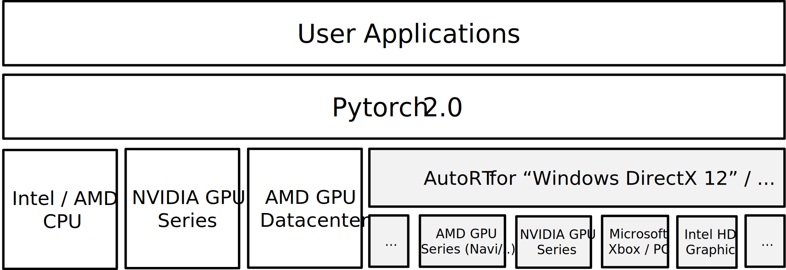
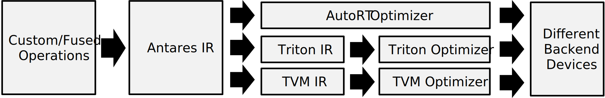

## AutoRT: the Next Generation of Antares.

(For legacy Antares, please redirect to documentation [README Legacy](README-legacy.md).)

AutoRT is a compiler solution that invents, evaluates and optimizes operators for Pytorch using your own accelerators.
- AutoRT can be as a [benchmark utility](#--playground-1---benchmark-your-windows-device) for device performance testing and profiling.
- AutoRT can also generate Pytorch2 of your device to accelerate standard [Pytorch applications](#quick-test-2-mnist-training-by-pytorch2-using-windows-directx) (e.g. DirectX).
- Additionally, AutoRT futher helps to construct [custom-defined](#quick-test-1-create-custom-operator-of-your-own-in-pytorch-2) / fused operators that are beyond the built-in functions of Pytorch.
- ***AutoRT for Windows DirectX 12 / Linux CUDA*** has experimental version [released](#--quick-installation-of-autort).
- Click [here](https://github.com/microsoft/antares/issues/new) to suggest more platforms (e.g. Pytorch2 for Windows ROCm / OpenCL / SYCL / Apple Metal / ..) you would like AutoRT to support in the follow-up releases.

#### Archtecture of AutoRT as a Backend for Pytorch 2.0:
<p align="center">
  
</p>

#### Workflow of Custom Operations from Antares IR to Different Backends:
<p align="center">
  
</p>


## - Quick Installation of AutoRT:

#### Requirements
| Platform | OS Requirement | Python Requirement | Download Link |
| --- | --- | --- | --- |
| DirectX 12 | Windows >= 10 / Microsoft XBox | [Python3.8](https://www.python.org/ftp/python/3.8.10/python-3.8.10-amd64.exe) | [Download](https://github.com/microsoft/antares/releases/download/v0.9.1/autort-0.9.1_directx-cp38-cp38-win_amd64.whl) |
| CUDA >= 11 | Ubuntu 20.04 (or images) | Python3.8 (from Ubuntu Repo) | [Download](https://github.com/microsoft/antares/releases/download/v0.9.1/autort-0.9.1_cuda-cp38-cp38-manylinux1_x86_64.whl) |
| .. | .. (More coming soon) .. |

#### Step-1: Python3 Installation.
For Ubuntu 20.04 (or equivalent containers below), ensure Python3.8 is installed by `sudo apt-get install python3.8-dev python3-pip`.
 * **Docker Image:** nvidia/cuda:11.8.0-cudnn8-devel-ubuntu20.04
 * **Docker Image:** nvidia/cuda:12.0.1-cudnn8-devel-ubuntu20.04
 * ..

For Windows 10/11, ensure Python3.8 is installed by downloading and installing "Python Requirement" links in [requirements](#requirements).


#### Step-2: Install AutoRT:
Download wheel file for your OS and platform from "Download Links" in [requirements](#requirements). Then using `python3.8 -m pip install *.whl` command to install the package.

```sh
python.exe -m pip install <local-file-path-for-autort-whl-package>
```

## - Playground 1 - Benchmark your Windows Device:

#### Quick Test 1: Benchmark to evaluate device memory bandwidth over DirectX 12.
```sh
$ python.exe -m autort.utils.memtest
  ...
  [1000/1000] AutoRT Device Memory Bandwidth: (Actual ~= 468.12 GB/s) (Theoretical ~= 561.75 GB/s)
```

#### Quick Test 2: Benchmark to evaluate device FP32 performance over DirectX 12.
```sh
$ python.exe -m autort.utils.fp32test
  ...
  [5000/5000] AutoRT FP32 TFLOPS: (Actual ~= 9.84 TFLOPS) (Theoretical ~= 10.93 TFLOPS)
```

## - Playground 2 - Running Pytorch2 over DirectX:

#### Quick Test 1: Create "custom operator" of your own in Pytorch 2.

- **Style-1: "Command Line Style"** Custom Operator Generation:
```sh
# First, create a custom sigmoid activation operator (without tuning):
$ python.exe -m autort.utils.export --ir "sigmoid_f32[N] = 1 - 1 / (1 + data[N].call(strs.exp))" -i data=float32[N:4096000]

# Create a custom sigmoid activation operator with autotuning for 200 steps:
$ python.exe -m autort.utils.export --ir "sigmoid_f32[N] = 1 - 1 / (1 + data[N].call(strs.exp))" -i data=float32[N:4096000] -c "tune:200"

# Then, use it in Pytorch 2 session:
$ python.exe
>> import torch, autort
>>
>> data = torch.arange(0, 10, dtype=torch.float32, device=autort.device())
>> output = autort.ops.sigmoid_f32(data)
>> print(output)
tensor([0.5000, 0.7311, 0.8808, 0.9526, 0.9820, 0.9933, 0.9975, 0.9991, 0.9997,
        0.9999])
```

- **Style-2: "AutoRT API Style"** Custom Operator Generation:
```sh
$ python.exe
>> import torch, autort
>>
>> autort.export(ir="sigmoid_f32[N] = 1 - 1 / (1 + data[N].call(strs.exp))", inputs=["data=float32[N:4096000]"])
>>
>> data = torch.arange(0, 10, dtype=torch.float32, device=autort.device())
>> output = autort.ops.sigmoid_f32(data)
>> print(output)
tensor([0.5000, 0.7311, 0.8808, 0.9526, 0.9820, 0.9933, 0.9975, 0.9991, 0.9997,
        0.9999])
```

#### Quick Test 2: MNIST Training by Pytorch2 using Windows DirectX:
```sh
$ python.exe -m autort.examples.mnist
  ...
  step = 100, loss = 2.2871, accuracy = 21.88 %
  step = 200, loss = 2.1408, accuracy = 46.88 %
  step = 300, loss = 1.6713, accuracy = 62.50 %
  step = 400, loss = 0.9573, accuracy = 62.50 %
  step = 500, loss = 0.8338, accuracy = 68.75 %
  step = 600, loss = 0.5882, accuracy = 84.38 %
  step = 700, loss = 0.2738, accuracy = 87.50 %
  step = 800, loss = 0.5159, accuracy = 87.50 %
  step = 900, loss = 0.5511, accuracy = 84.38 %
  step = 1000, loss = 0.2616, accuracy = 93.75 %
  ...
```

#### Quick Test 3: Fine-tune existing operators to make Pytorch Builtin Operators run faster.
```sh
$ python.exe -m autort.utils.mmtest

  >> Performance of your device:

     `MM-Perf` (current) = 4.15 TFLOPS
    ~~~~~~~~~~~~~~~~~~~~~~~~~~~~~~~~~~~~~
  >> ...

$ python.exe -m autort.utils.export -s 4000

  Module file for operator `gemm_f32` has been exported to `.\ops\gemm_f32.mod`.

  ..

$ python.exe -m autort.utils.mmtest

  >> Performance of your device:

     `MM-Perf` (current) = 9.71 TFLOPS
    ~~~~~~~~~~~~~~~~~~~~~~~~~~~~~~~~~~~~~
  >> ...
```

If you like it, welcome to report issues or donate stars which can encourage AutoRT to support more backends, more OS-type and more documentations. See More Information about Microsoft [Contributing](CONTRIBUTING.md) and [Trademarks](TRADEMARKS.md).
