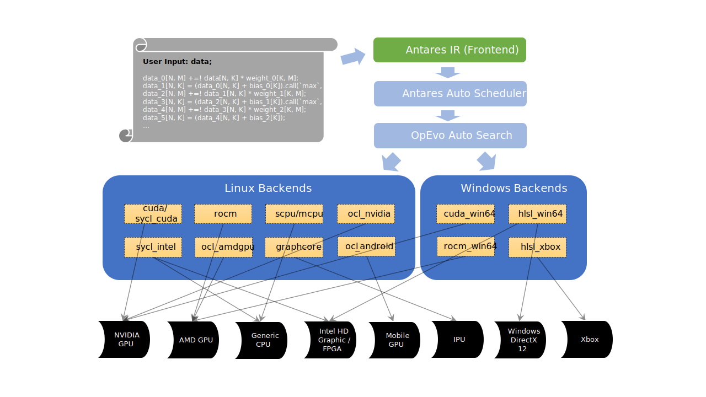

## What is Antares:

**Antares** is an automatic engine to generate multi-platform kernels with optimization for ***DNN developers*** (targeting to backends like CUDA/ROCm/CPU/DirectX12/Graphcore/OneAPI/..). It is also a framework for ***Hardware developers*** to extend new backends/hareware quickly and easily. Antares provides IR that follows "_One Language Syntax for All Platforms_", and general-purpose device access APIs that hide the differences of not only DNN description but also device mapping.

1. [Features](#about-antares-features)
    - Backend Extension
    - Effective Auto Tuning
    - Einsum-based Antares IR
    - Framework JIT Extension (Op Maker Plugin for Pytorch/Tensorflow/Tensorflow2)

2. [How to Use Antares](#how-to-use-antares)
    - **Senario-1:** Quick Start for Developers that Use Antares to Tune Operator/Sub-graph in Foreground Terminal
    - **Senario-2:** Quick Start for Developers that Use Antares to Extend Operator/Sub-graph in Pytorch/Tensorflow

3. [Antares Pre-dependencies for Different Backends](#antares-predependencies--for-different-backends)
    - **Linux-based:** cuda, rocm, mcpu, scpu, gc, sycl_intel, sycl_cuda, ocl_amdgpu, ocl_nvidia, ocl_android, ..
    - **Windows-based:** cuda_win64, rocm_win64, hlsl_win64, ..

4. [About Microsft Open Source](#about-microsft-open-source)

## About Antares Features:

#### a. Backend Extension

The current version of Antares supports code generation for the following backends (in orange blocks) and devices (in black blocks):



#### b. Effective Auto Tuning

Auto tuning by Antares contributes to not only much less tuning time, but also equivalent or better performance for Intra-op/Inter-op execution (against TVM Ansor).


#### c. Einsum-based Antares IR

- Antares IR is the frontend of both kernel generation and automatic optimization.
- The syntax of Antares IR is slim to describe most MLP/CNN/RNN/LSTM/Transformer based models like MNIST/ResNet/BERT/GPT/..

  **E.g. The following computation logic describes a layer of standard BERT transformer:**

``` sh
  merged_layer_local[R, B, S1, N1, H1] +=! input_tensor[B, S1, N, H] * qkv_weight[R, N, H, N1, H1];
  merged_layer_trans[R, B, N1, S1, H1] = merged_layer_local[R, B, S1, N1, H1] + qkv_bias[R, N1, H1];
  attention_scores[B, N1, S1, S2] +=! merged_layer_trans[0, B, N1, S1, H1] * merged_layer_trans[1, B, N1, S2, H1] / const({H}).cast(`float32`);
    softmax_1_temp0[B, N1] >=! attention_scores[B, N1, S1, S2];
    softmax_1_temp1[B, N1] +=! (attention_scores[B, N1, S1, S2] - softmax_1_temp0[B, N1]).call(`exp`);
  attention_probs[B, N1, S1, S2] = (attention_scores[B, N1, S1, S2] - softmax_1_temp0[B, N1]).call(`exp`) / softmax_1_temp1[B, N1];
  ... ...
  layer_norm_2_src[B, S1, N2, H2] = layer_output[B, S1, N2, H2] + attention_output_norm[B, S1, N2, H2];
    layer_norm_2_temp0[B, S1] += layer_norm_2_src[B, S1, N2, H2];
    layer_norm_2_temp1[B, S1] += layer_norm_2_src[B, S1, N2, H2] * layer_norm_2_src[B, S1, N2, H2];
  layer_output_norm[B, S1, N2, H2] = (layer_norm_2_src[B, S1, N2, H2] * {N * H} - layer_norm_2_temp0[B, S1]) * (layer_norm_2_temp0[B, S1] * {N * H} - layer_norm_2_temp1[B, S1] * layer_norm_2_temp1[B, S1]).call(`max`, [1e-8]).call(`rsqrt`);
```
For more IR usage or examples, please follow documentation here: [Antares IR & Examples](AntaresIR.md)

#### d. Pytorch/Tensorflow/Tensorflow2 Op Maker (JIT Plugin)
  Antares provides JIT plugin for Pytorch/Tensorflow/Tensorflow2 to help frameworks to easily extend new operators, e.g.:

```py
# Tensorflow/Tensorflow2 Example:
op = antares.make_op(ir='dot_0[N, M] +=! data[N, K] * weight[K, M]', feed_dict={'data': x, 'weight': y}).emit()
result_1 = sess.run(op)
print('The custom result_1 is:\n%s' % result_1)
result_2 = sess.run(tf.add(op, op))
print('The custom result_2 is:\n%s' % result_2)  

# Pytorch Example:
custom_op = CustomOp(ir='dot_0[N, M] +=! data[N, K] * weight[K, M]', input_orders={'data': x, 'weight': y}).to(device).emit()
result = custom_op(x, y)
print('The custom result is:', result)
```
For complete programs, please follow examples here: [Antares Examples for Pytorch](frameworks/pytorch/examples) and [Antares Examples for TF/TF2](frameworks/tensorflow/examples)

## How to Use Antares?

### Senario-1: Quick Start for Developers that Use Antares to Tune Operator/Sub-graph in Foreground Terminal:

- Step-1 (Recommend for User with Root): Prepare Environment for Docker Mode
```sh
# Setup Package dependencies
sudo apt install docker.io

# Get Antares
git clone https://github.com/microsoft/antares --branch v0.2.x
cd antares/

# Set default backend type:
echo 'c-cuda' > backend.default

# Build the environment with sudo (if this step failed, please go to "Pre-dependencies" section to check which "backend-related dependencies" are missing):
sudo make
```
- Step-1 (Recommend for Non-root Users): Prepare Environment for Host Mode
```sh
# Ensure Package dependencies (Please ensure the following root-required dependencies has been installed.)
sudo apt install git python3-pip g++ make g++-mingw-w64-x86-64

# Get Antares
git clone https://github.com/microsoft/antares --branch v0.2.x
cd antares/

# Set default backend type:
echo 'c-cuda' > backend.default

# Build the environment without sudo (if this step failed, please go to "Pre-dependencies" section to check which "backend-related dependencies" are missing):
make
```
  All valid backends are listed in directory [antares/backends](backends)

- Step-2: Tune a Specific Workload in Foreground

```sh
# Example-1: Run the following command in bash to tune MatMul (4096, 4096) x (4096, 4096) using 2000 trials:
COMMIT=force STEP=2000 COMPUTE_V1='- S = 4096; einstein_v2(input_dict={"input0": {"dtype": "float32", "shape": [S, S]}, "input1": {"dtype": "float32", "shape": [S, S]}}, exprss="output0[N, M] +=! input0[N, K] * input1[K, M]")' make

# Example-2: Run the following command in bash to tune MNIST-inference using 5000 trials:
COMMIT=force STEP=5000 COMPUTE_V1='- einstein_v2(input_dict={"data": {"dtype": "float32", "shape": [64, 784]}, "weight_0": {"dtype": "float32", "shape": [784, 512]}, "weight_1": {"dtype": "float32", "shape": [512, 512]}, "weight_2": {"dtype": "float32", "shape": [512, 10]}, "bias_0": {"dtype": "float32", "shape": [512]}, "bias_1": {"dtype": "float32", "shape": [512]}, "bias_2": {"dtype": "float32", "shape": [10]}}, extra_outputs=[], exprss="data_0[N, M] +=!  data[N, K] * weight_0[K, M];   data_1[N, K] =   (data_0[N, K] + bias_0[K]).call(`max`, [0.0]);   data_2[N, M] +=!  data_1[N, K] * weight_1[K, M];   data_3[N, K] =   (data_2[N, K] + bias_1[K]).call(`max`, [0.0]);   data_4[N, M] +=!  data_3[N, K] * weight_2[K, M];   data_5[N, K] =   (data_4[N, K] + bias_2[K]);")' make

```
  Apart from detailed reporting logs during the tuning procedure, the best kernel record will be saved to directory [antares/codehub](codehub). If you don't want to create/overwrite existing kernel record in codehub, environment variable `COMMIT=force` in the tuning command can be removed.

### Senario-2: Quick Start for Developers that Use Antares to Extend Operator/Sub-graph in Pytorch/Tensorflow (only for CUDA & ROCm backend currently):

- Step-1: Prepare Environment

  You need to follow `Step-1` from Senario-1 to finish environment preparation beforehand. This prevents many environmental issues when walking to the next step.

- Step-2: Set up a corresponding TF/TF2/Pytorch version that matches your CUDA/ROCm driver version. (**If you have installed TF/TF2/Pytorch, please just ignore this step**)

  Here we provide several prebuilt package sources that match different environment requirements:

        For Tensorflow 1.x & 2.x: Recommended Packages (tested in Ubuntu 20.04):
        #   Tensorflow-1 for NVIDIA CUDA 10.0:
        python3 -m pip install --upgrade pip && python3 -m pip install tensorflow-gpu==1.15.4
        #   Tensorflow-1 for NVIDIA CUDA 11.0:
        python3 -m pip install --upgrade pip && python3 -m pip install https://github.com/ghostplant/tensorflow-wheel-collections/releases/download/cuda-11/tensorflow_gpu-1.15.4_cuda11+nv-cp38-cp38-linux_x86_64.whl
        #   Tensorflow-1 for AMD ROCm 4.2:
        python3 -m pip install tensorflow-rocm==1.15.12

        #   Tensorflow-2 for NVIDIA CUDA 11.0:
        python3 -m pip install --upgrade pip && python3 -m pip install tensorflow-gpu==2.4.0
        #   Tensorflow-2 for AMD ROCm 4.2:
        python3 -m pip install tensorflow-rocm==2.4.3

        For Pytorch 1.10: Recommended Packages (tested in Ubuntu 20.04):
        #   Pytorch for NVIDIA CUDA >= 10.2:
        python3 -m pip install --user torch==1.10.0+cu102 torchvision==0.11.1+cu102 torchaudio==0.10.0+cu102 -f https://download.pytorch.org/whl/torch_stable.html
        #   Pytorch for NVIDIA CUDA >= 11.3:
        python3 -m pip install --user torch==1.10.0+cu113 torchvision==0.11.1+cu113 torchaudio==0.10.0+cu113 -f https://download.pytorch.org/whl/torch_stable.html
        #   Pytorch for AMD ROCm 4.2:
        python3 -m pip install --user torch==1.10.0+rocm4.2 torchvision==0.11.1+rocm4.2 -f https://download.pytorch.org/whl/torch_stable.html

- Step-3: Install JIT Plugin Client and Run Examples

    ```sh
    # If using Pytorch, set up JIT Plugin for Pytorch:
    sudo python3 ./frameworks/pytorch/setup.py

    # If using Tensorflow, set up JIT Plugin for Tensorflow/Tensorflow2:
    sudo python3 ./frameworks/tensorflow/setup.py

    # Set the path of Antares root directory:
    export ANTARES_ROOT="(..clone path to antares..)/"

    # Test Examples for Pytorch:
    cd ./frameworks/pytorch/examples
    ./1_hello_world.py

    # Test Examples for Tensorflow:
    cd ./frameworks/tensorflow/examples
    ./1_hello_world.py
    ```
  More examples here: [Antares Examples for Pytorch](frameworks/pytorch/examples) and [Antares Examples for TF/TF2](frameworks/tensorflow/examples)

## Antares Predependencies  for Different Backends:

Before running `make` command in antares root directory, you need to ensure the corresponding backend driver is installed correctly.

- Predependencies for backend `c-cuda`, `c-sycl_cuda`:

    `Requirement: Ubuntu >= 18.04`

    `Requirement: Install NVIDIA CUDA toolkit (>= 10.0) on Host OS`

    `Requirement: docker`

- Predependencies for backend `c-ocl_nvidia`:

    `Requirement: Ubuntu >= 18.04`

    `Requirement: Install NVIDIA CUDA toolkit (>= 10.0) to Host OS`

    `Requirement: run bash command "make install_host" in antares root directory beforehand`

- Predependencies for backend `c-ocl_android`, `c-mcpu_android`:

    `Requirement: Ubuntu >= 18.04`

    `Requirement: Install package "adb", connect to rooted Android device and ensure command "adb shell su -c 'ls /sdcard'" works`

    `Requirement: run bash command "make install_host" in antares root directory beforehand`

    `Requirement: Install Android NDK and make a link in PATH to ensure command "aarch64-linux-android-clang++" works, e.g. "sudo ln -s (path to ndk's clang)/bin/aarch64-linux-androidi26-clang++ /usr/local/bin/aarch64-linux-android-clang++"`

- Predependencies for backend `c-rocm`, `c-ocl_amdgpu`:

    `Requirement: Ubuntu >= 18.04`

    `Requirement: Install AMD ROCm (>= 4.0) package "rock-dkms" & "rock-dkms-firmware" from repo http://repo.radeon.com/rocm/apt/debian to Host OS`

    `Requirement: docker`

- Predependencies for backend `c-ipu`:

    `Requirement: Ubuntu >= 18.04`

    `Requirement: Install Poplar SDK to Host OS, ensure "popc" command exists in system PATH`

    `Requirement: run bash command "make install_host" in antares root directory beforehand`

- Predependencies for backend `c-scpu`, `c-mcpu`, `c-sycl_intel`:

    `Requirement: Ubuntu >= 18.04`

    `Requirement: docker`

- Predependencies for backend `c-hlsl_win64`, `c-hlsl_xbox`:

    `Requirement: Windows 10 64 bit (>= 2004), run "dxdiag.exe" to ensure Direct3D 12.0 Accleration is enabled`

    `Requirement: Windows Subsystem Linux 1.0` [How to Install WSL 1.0](https://docs.microsoft.com/en-us/windows/wsl/install-win10)

    `Requirement: GIT clones antares repo inside WSL environment, and the path of antares directory should be **visible to Windows**, (e.g. "/../c/Users/me/Desktop/antares" would be OK, but "/home/me/antares" won't).`

    `Requirement: run bash command "make install_host" in antares root directory beforehand`

- Predependencies for backend `c-rocm_win64`:

    `Requirement: Windows 10 64 bit (>= 2004)`

    `Requirement: Windows Subsystem Linux 1.0` [How to Install WSL 1.0](https://docs.microsoft.com/en-us/windows/wsl/install-win10)

    `Requirement: Install Official AMD GPU driver (release version >= 2020.11).` Ensure `C:\Windows\System32\amdhip64.dll` exists after installation.

    `Requirement: GIT clones antares repo inside WSL environment, and the path of antares directory should be **visible to Windows**, (e.g. "/../c/Users/me/Desktop/antares" would be OK, but "/home/me/antares" won't).`

    `Requirement: run bash command "make install_host" in antares root directory beforehand`

- Predependencies for backend `c-cuda_win64`:

    `Requirement: Windows 10 64 bit (>= 2004)`

    `Requirement: Windows Subsystem Linux 1.0` [How to Install WSL 1.0](https://docs.microsoft.com/en-us/windows/wsl/install-win10)

    `Requirement: Install Official NVIDIA CUDA driver (>= 10.0).` Ensure `C:\Windows\System32\nvcuda.dll` exists after installation.

    `Requirement: GIT clones antares repo inside WSL environment, and the path of antares directory should be **visible to Windows**, (e.g. "/../c/Users/me/Desktop/antares" would be OK, but "/home/me/antares" won't).`

    `Requirement: run bash command "make install_host" in antares root directory beforehand`

## Current Support Table:

|       | HIP-C(c-rocm/c-rocm_win64) | CUDA(c-cuda/c-cuda_win64) | CPU(c-mcpu/c-scpu) | DirectX12(c-hlsl_win64) | Graphcore(c-ipu) | Intel OneAPI(c-sycl_intel) | Codeplay DPCPP (c-sycl_cuda) |
|---|---|---|---|---|---|---|---|
| Deploy Environment | Linux/WSL1/WSL2 | Linux | Linux | WSL1/WSL2 | Linux | Linux |   |
| Target Device | AMDGPU | NVGPU | Generic CPU | Generic Graphic Card | IPU Device | Intel CPU/HD Graphic/FPGA |  NVGPU |
| Global schedules  | Y | Y | Y | Y | Y | Y | Y |
| Local schedules   | Y | Y | Y | Y |   | Y | Y |
| Head fusion       | Y | Y | Y | Y | Y | Y | Y |
| Tail fusion       | Y | Y |   | Y |   |   | Y |
| Evaluator         | Y | Y | Y | Y | Y | Y | Y |
| Tensorflow Plugin | Y | Y | Y (intel-tensorflow) |   |   |   |   |
| Pytorch Plugin    | Y | Y | Y |   |   |   |   |
| Multi Kernel Eval | Y | Y | Y | Y |   | Y | Y |

## About Microsft Open Source
For more information about Microsoft Open Source Policy, please see [Microsoft Open Source Code of Conduct](https://opensource.microsoft.com/codeofconduct)

