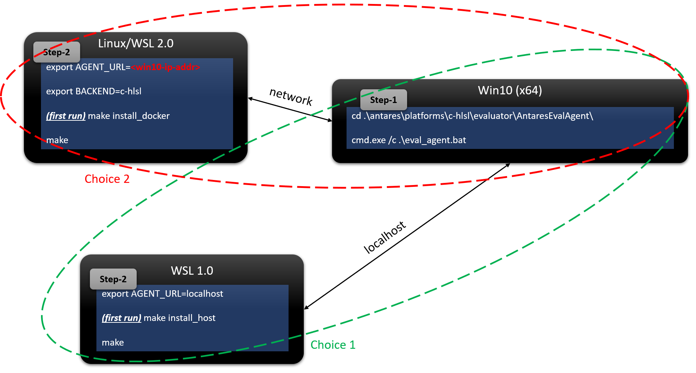

# Install Antares Engine for DirectX12 HLSL Codegen:

1) First, you need a Win10 (64-bit) OS with DirectX12 enabled, and this host is used to activate the Antares HLSL Eval Agent.

2) Then, you either need a remote Linux Host or WSL 1.0/2.0 environment. Here is the guide to [install WSL for Win10](https://docs.microsoft.com/en-us/windows/wsl/install-win10). Ensure the Linux environment can interact with Win10 over network.

3) Launch the Antares HLSL Eval Agent script on Win10 by executing `eval_agent.bat` and waiting for the service daemon to start up successfully.

4) In either choice of the Linux/WSL environment, you should run the script that is shown in the corresponding environment from HLSL installation image below, which is to install Antares dependencies by `make install_docker` (Standard Linux) or `make install_host` (WSL 1.0 only).

5) To tune workloads for better efficiency, just run standard Antares tuning commands with an additional environment variable `AGENT_URL` attached at the begining of the `make` command, e.g.:

```sh
export AGENT_URL=<win10-ip-addr>
STEP=100 COMPUTE_V1='- einstein_v2("output0[N] +=! input0[N, C]", input_dict={"input0": {"dtype": "float32", "shape": [32, 1024]}})' make
```


